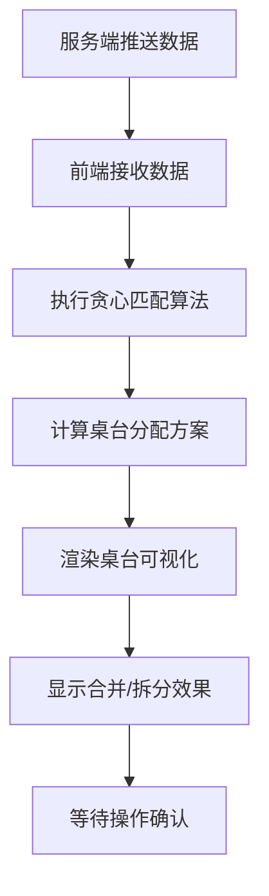

## 1. 产品概述

餐饮店智能排号调度系统，帮助餐厅高效管理座位分配和排队叫号。通过贪心匹配算法自动将小桌拼接成大桌，最大化座位利用率，减少顾客等待时间。

- 目标用户：餐饮门店经理、前台服务员
- 核心价值：提升翻台率、优化顾客体验、减少人工调度成本

## 2. 核心功能

### 2.1 功能模块

1. **调度面板主页**：实时桌台状态、排队列表、智能分配建议
2. **桌台可视化**：动态展示桌台合并/拆分状态
3. **排队管理**：显示当前排队号码和人数

### 2.2 页面详情

| 页面名称 | 模块名称 | 功能描述 |
|----------|----------|----------|
| 调度面板 | 桌台状态区 | 显示所有桌台的占用情况、可合并状态 |
| 调度面板 | 排队列表区 | 显示当前排队号码、人数、等待时长 |
| 调度面板 | 智能分配区 | 显示算法推荐的座位分配方案 |
| 调度面板 | 实时统计 | 显示空桌数、排队人数、平均等待时间 |

## 3. 核心流程

1. 服务端推送当前空桌数量和排队列表
2. 前端接收数据后执行贪心匹配算法
3. 算法计算最优桌台分配方案（包括小桌拼接大桌）
4. 动态渲染桌台状态变化
5. 服务员确认分配或手动调整

## 4. 用户界面设计

### 4.1 设计风格
- 主色调：暖橙色（#FF6B35）代表餐饮行业活力
- 辅助色：深绿色（#2D6A4F）表示可用座位
- 警告色：深红色（#D62828）表示占用状态
- 按钮风格：圆角卡片式，带阴影效果
- 字体：思源黑体，清晰易读

### 4.2 页面设计概览

| 页面名称 | 模块名称 | UI元素 |
|----------|----------|--------|
| 调度面板 | 桌台状态区 | 卡片网格布局，不同颜色区分状态，动画显示合并效果 |
| 调度面板 | 排队列表区 | 列表视图，显示号码、人数、等待时间 |
| 调度面板 | 智能分配区 | 高亮显示推荐方案，可点击确认 |

### 4.3 响应式设计
- 桌面端优先设计，适配1920x1080及以上分辨率
- 平板端自适应，保持核心功能可用
- 触控优化，支持点击操作
