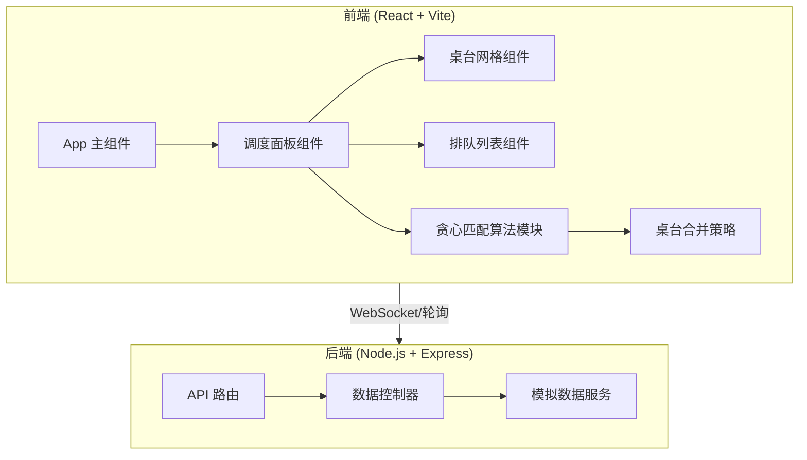

## 1. 架构设计



## 2. 技术说明

- 前端：React@18 + Vite + CSS Modules
- 后端：Node.js + Express
- 通信：REST API（简单轮询）
- 构建工具：Vite

## 3. 路由定义

| 路由 | 用途 |
|------|------|
| / | 调度面板主页 |

## 4. API 定义

### GET /api/status
获取当前餐厅状态

**响应结构：**
```typescript
interface TableStatus {
  id: number;
  capacity: number;
  occupied: boolean;
  mergedWith: number[];
}

interface QueueItem {
  number: number;
  peopleCount: number;
  waitTime: number;
}

interface RestaurantStatus {
  tables: TableStatus[];
  queue: QueueItem[];
  emptyTables: number;
}
```

## 5. 贪心匹配算法设计

### 核心逻辑
1. 将排队顾客按人数从大到小排序
2. 优先分配刚好能容纳的单桌
3. 对于超大团体，尝试合并相邻小桌
4. 使用首次适应算法（First Fit）减少碎片

### 桌台合并策略
- 2人桌 + 2人桌 = 4人桌
- 2人桌 + 3人桌 = 5人桌
- 3人桌 + 3人桌 = 6人桌
- 可连续合并多个小桌

## 6. 数据模型

### 6.1 桌台数据
```typescript
interface Table {
  id: number;
  capacity: number;
  status: 'empty' | 'occupied' | 'reserved';
  groupId: number | null;
}
```

### 6.2 排队数据
```typescript
interface QueueItem {
  number: number;
  peopleCount: number;
  arrivalTime: Date;
}
```
